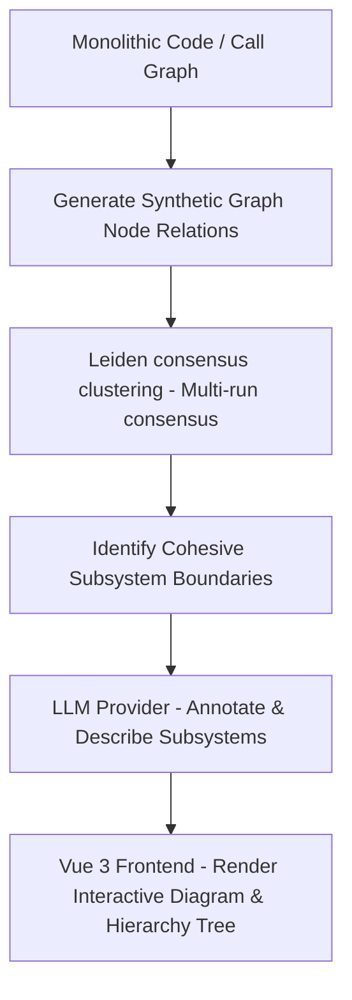

# Subsystem Discovery Engine

A premium developer tool that automatically discovers, extracts, and labels logical subsystems and module boundaries in complex codebases using Leiden consensus clustering and Large Language Models (LLMs).

---

## 📌 Purpose of the Application
In large software systems, understanding the logical boundaries of code is a massive challenge. The **Subsystem Discovery Engine** analyzes call graphs and class dependencies, partitioning classes and methods into distinct, cohesive "subsystems" (modules). It then uses AI (LLMs) to automatically interpret the business purpose of each subsystem and label it accordingly, giving developers a structured, visual map of their software architecture.

---

## 🔍 Why It Is Needed
- **Legacy Monolith Modernization**: Migrating a monolithic application to microservices is extremely difficult without clear boundary definitions.
- **Spaghetti Architecture**: Over time, software dependencies become tangled, increasing cognitive load for developers and raising the risk of regressions.
- **Outdated Documentation**: Manual architecture diagrams are static and quickly become stale. This engine discovers actual, runtime dependencies directly from the codebase.
- **Automated Refactoring**: Helps teams safely identify tightly coupled code segments that should be isolated or refactored.

---

## 🎯 Goals
1. **Automate Module Boundary Detection**: Group classes together into highly cohesive clusters while minimizing coupling between clusters.
2. **Explain Complexity with AI**: Generate readable business-focused domain explanations for clustered modules.
3. **Interactive Visual Exploration**: Provide a real-time, interactive graph visualization of the system subsystems.
4. **Consistency**: Use Leiden consensus clustering across multiple execution runs to guarantee stable, reliable boundary results.

---

## 💎 Benefits
- **High Partitioning Accuracy**: The Leiden consensus clustering algorithm handles large-scale graphs efficiently and produces superior modularity compared to Louvain or other basic clustering techniques.
- **Dynamic Visual Feedback**: Zoom, pan, and click on nodes in the interactive Mermaid diagram to drill down into subsystem details.
- **Reduced Onboarding Time**: New developers can understand the logical architecture in minutes instead of wading through hundreds of source files.
- **Flexible Configuration**: Tweak resolution parameters, consensus thresholds, and LLM prompts on the fly to see how the software boundaries change.
- **Dark & Light Mode Integration**: sleeks, accessible dashboard that adapts to developer workspaces with a single toggle.

---

## ⚙️ How It Works (The Pipeline)

The system operates in four distinct phases:



1. **Relation Extraction**: Class-to-class dependency connections and coupling weights are extracted (or simulated for the POC using structured presets like Amazon, Netflix, and E-commerce templates).
2. **Leiden consensus clustering**: The backend executes the Leiden clustering algorithm multiple times. It builds a consensus matrix where an edge between two nodes only exists if they are placed in the same cluster across a defined threshold of executions (e.g., 70% of runs).
3. **LLM Domain Labeling**: The identified cluster nodes, stability scores, and relationships are compiled and sent to an LLM provider (supporting Gemini, DeepSeek, or a fast Mock provider). The LLM assigns a clean business name and summarizes the subsystem's architectural role.
4. **Visual Rendering**: The frontend displays a collapsible sidebar config panel, a hierarchical subsystem tree list, and a zoomable, drag-and-pan Mermaid.js graph canvas.

---

## 🛠️ Tech Stack
- **Backend**: Java 17, Spring Boot, MyBatis, H2 Database (In-Memory), Maven
- **Frontend**: Vue 3 (Composition API), Vite, Vanilla CSS, Mermaid.js
- **AI Integrations**: OpenRouter, Google Gemini API

---

## 🚀 How to Run the Application

This project runs as a split-process application: a **Java Spring Boot backend** and a **Vue 3 / Vite frontend**.

### Prerequisites
- **Java 17+**
- **Maven**
- **Node.js 18+ & npm**

---

### Step 1: Run the Backend (Spring Boot)

1. Set your LLM API keys as environment variables in your terminal (required if using live AI annotations):
   ```powershell
   # In PowerShell (Windows):
   $env:OPENROUTER_API_KEY="your-openrouter-key"
   $env:GEMINI_API_KEY="your-gemini-key"
   ```
2. Navigate to the `java` directory and start the application:
   ```bash
   cd java
   mvn clean spring-boot:run
   ```
3. The backend starts on **port 8081** with context path `/codeanalyzer/server`.
   - **H2 DB Console URL**: `http://localhost:8081/codeanalyzer/server/h2-console`
     - JDBC URL: `jdbc:h2:mem:subsystem_discovery`
     - Username: `sa` (no password)

---

### Step 2: Run the Frontend (Vue 3 / Vite)

1. Open a new terminal window, navigate to the `poc-ui` directory, and install dependencies:
   ```bash
   cd poc-ui
   npm install
   ```
2. Start the Vite development server:
   ```bash
   npm run dev
   ```
3. Open `http://localhost:5173/` in your browser.

---

## 💡 Key Features Added in This POC
- **Collapsible Panels**: Tree-views and summary panels can slide shut to maximize diagram canvas space.
- **Custom Prompts**: Enter custom chat prompts to generate tailormade architectural reports on the fly.
- **Standardized Tooltips**: Hover over stability metrics, connectivity parameters, or the graph legend icon to view helpful tooltips.
- **Theme Persistence**: Switching between Light and Dark mode auto-adjusts layout panels, buttons, inputs, and SVG diagram nodes, persisting your choice locally.
